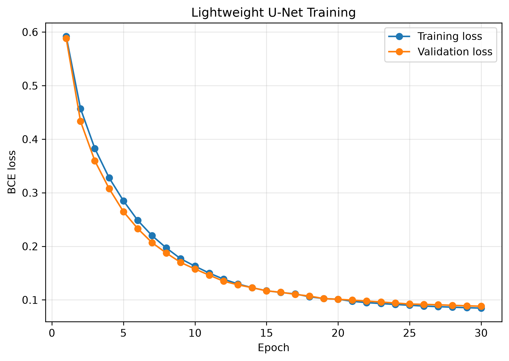
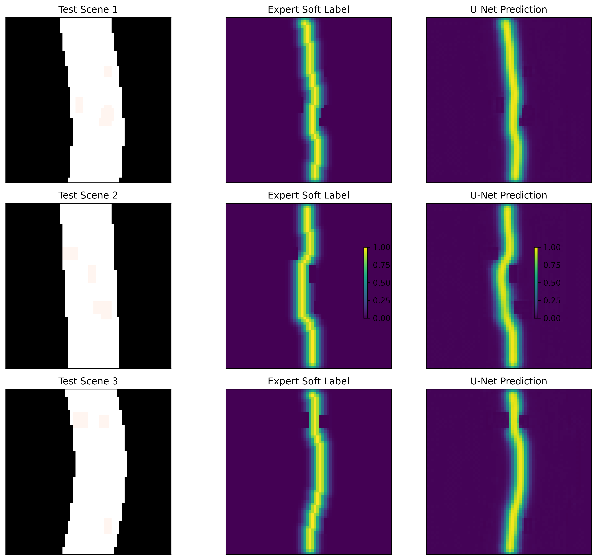
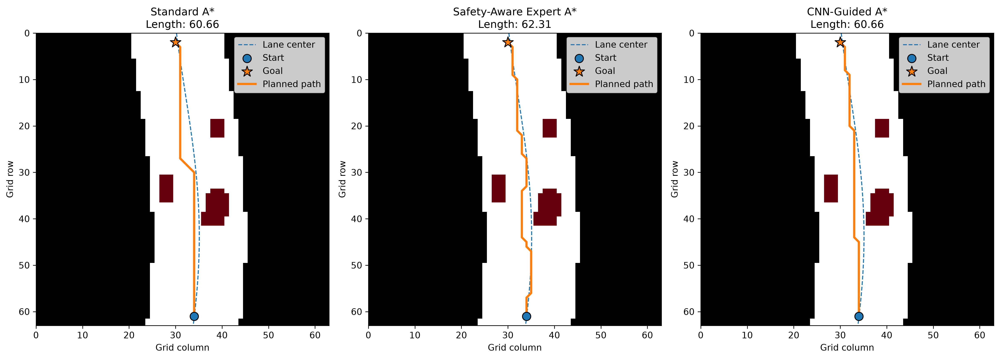

# Safety-Aware CNN Cost Map for A*-Based Path Planning

A hybrid learning-and-search framework for safety"}

# Safety-Aware CNN Cost Map for A*-Based Path Planning

A hybrid learning-and-search framework for safety-aware path planning in simulated autonomous-driving scenarios.

This project trains a lightweight U-Net to learn spatial path preferences from safety-aware expert A* demonstrations. The predicted preference map is converted into a learned traversal cost and used to guide a conventional A* planner. Hard obstacle and road-boundary constraints remain enforced by the search algorithm, so the neural network guides *where* the planner prefers to travel without replacing collision checking or path connectivity.

> Course project for **Artificial Intelligence for Robotics**

## Overview

Standard geometric A* finds short collision-free paths, but it does not explicitly prefer:

* larger clearance from obstacles,
* lane-centered motion,
* larger road-boundary margins,
* driving-like spatial behavior.

This project addresses that limitation with the following pipeline:

```text
Synthetic BEV Scene
        ↓
Safety-Aware Expert A*
        ↓
Gaussian Soft Path Labels
        ↓
Lightweight U-Net
        ↓
Predicted Path-Preference Map
        ↓
Learned Traversal Cost
        ↓
CNN-Guided A*
```

The neural network does **not** directly generate the final path. Instead, it predicts a dense spatial preference map that modifies the traversal cost used by A*.

Cells containing obstacles or lying outside the drivable road remain non-traversable regardless of the CNN output.

---

## Final Results

All final planner comparisons were performed on **100 held-out procedurally generated scenes** that were not used for training or hyperparameter selection.

### CNN-Guided A* vs. Standard A*

| Metric                     | Standard A* | CNN-Guided A* | Result                |
| -------------------------- | ----------: | ------------: | --------------------- |
| Success rate               |        100% |          100% | Maintained            |
| Mean path length           |      61.288 |        63.001 | +2.80%                |
| Minimum obstacle clearance |       1.211 |         2.004 | Improved              |
| Mean lane deviation        |       1.648 |         1.289 | Reduced               |
| Distance to expert path    |       1.708 |         0.422 | Substantially reduced |

The results show that CNN-guided A* inherits important spatial preferences from the safety-aware expert while preserving reliable path generation.

### Statistical Results

Paired Wilcoxon signed-rank tests were performed on the same 100 held-out scenes.

| Hypothesis | Comparison                     |      p-value | Conclusion |
| ---------- | ------------------------------ | -----------: | ---------- |
| H1         | CNN path closer to expert path | 5.07 × 10⁻¹⁶ | Supported  |
| H2a        | Increased obstacle clearance   | 8.58 × 10⁻¹³ | Supported  |
| H2b        | Reduced lane deviation         |  9.82 × 10⁻⁵ | Supported  |

CNN-guided A* produced statistically longer paths than standard A*, but the average increase was only **2.80%**, while both methods maintained a **100% planning success rate**.

---

## Representative Results

### U-Net Training



The lightweight U-Net was trained for 30 epochs. The best checkpoint achieved:

* Best validation BCE loss: **0.0878**
* Held-out test BCE loss: **0.0885**

The close validation and test losses indicate that the learned spatial representation generalized well to unseen scenes from the same procedural distribution.

### Learned Path Preferences



The network learns a smooth approximation of the Gaussian expert-path corridor and adapts its prediction to road geometry and obstacle placement.

### Planner Comparison



The CNN-guided planner tends to retain much of the geometric efficiency of standard A* while shifting the route toward the safer behavior demonstrated by the expert planner.

---

## Method

### 1. Synthetic Driving Scenes

Each scene is represented as a `64 × 64` bird's-eye-view grid with five input channels:

| Channel | Content                |
| ------- | ---------------------- |
| 1       | Drivable-road mask     |
| 2       | Static-obstacle mask   |
| 3       | Lane-center preference |
| 4       | Start-position heatmap |
| 5       | Goal-position heatmap  |

Road curvature and obstacle layouts are procedurally generated from random seeds.

Scene generation rejects configurations without a valid start-to-goal path.

### 2. Standard A*

The geometric baseline uses:

* 8-connected motion,
* axial movement cost `1`,
* diagonal movement cost `√2`,
* octile-distance heuristic,
* no diagonal corner cutting.

### 3. Safety-Aware Expert A*

The expert planner uses the same A* search structure but adds rule-based spatial penalties for:

* obstacle proximity,
* road-boundary proximity,
* lane-center deviation.

The expert traversal cost is

```text
C = 1
    + 8 × obstacle_cost
    + 4 × boundary_cost
    + 2 × lane_cost
```

This planner is used to generate supervision rather than as the learned method itself.

### 4. Gaussian Expert Labels

A one-cell-wide expert path would create a highly imbalanced learning target.

Each expert path is therefore converted into a Gaussian corridor:

```text
P(x, y) = exp(-d(x, y)^2 / (2σ^2))
```

with

```text
σ = 2 grid cells
```

where `d(x, y)` is the Euclidean distance to the nearest expert-path cell.

### 5. Lightweight U-Net

The network maps

```text
5 × 64 × 64
```

scene tensors to

```text
1 × 64 × 64
```

path-preference maps.

Main training configuration:

| Parameter     |             Value |
| ------------- | ----------------: |
| Base channels |                16 |
| Batch size    |                32 |
| Epochs        |                30 |
| Optimizer     |              Adam |
| Learning rate |          1 × 10⁻³ |
| Loss          | BCEWithLogitsLoss |
| Label σ       |               2.0 |

The model checkpoint with the lowest validation loss is retained.

### 6. CNN-Guided A*

The learned preference map `P_CNN` is converted into a traversal penalty:

```text
C_learned = 1 - P_CNN
```

and the final CNN-guided traversal map is:

```text
C_CNN = 1 + λ C_learned
```

The learned-cost weight was selected using the validation set.

Final value:

```text
λ = 2.0
```

Increasing λ beyond 2 produced only small additional obstacle-clearance gains while increasing path length and local turning.

---

## Dataset

The generated dataset contains:

```text
Training:     800 scenes
Validation:   100 scenes
Test:         100 scenes
```

The splits use non-overlapping seed ranges.

Additional unseen scenes were generated separately for the final planner evaluation.

Generated `.npz` datasets are intentionally excluded from the repository because they can be reproduced directly using the provided code.

---

## Repository Structure

```text
safety-aware-cnn-a-star-planning/
│
├── notebooks/
│   ├── 01_scene_generation.ipynb
│   ├── 02_planning_baselines.ipynb
│   ├── 03_dataset_generation.ipynb
│   ├── 04_unet_training.ipynb
│   └── 05_final_evaluation.ipynb
│
├── src/
│   ├── scene_generator.py
│   ├── planners.py
│   ├── cost_maps.py
│   ├── labels.py
│   ├── dataset_generation.py
│   ├── torch_dataset.py
│   ├── models.py
│   ├── training.py
│   ├── learned_cost.py
│   ├── metrics.py
│   ├── evaluation.py
│   ├── statistical_analysis.py
│   ├── results_io.py
│   └── visualization.py
│
├── models/
│   └── best_unet.pt
│
├── results/
│   ├── figures/
│   └── final_test/
│
├── reports/
│   └── AStar_CostMap_Final_Paper.pdf
│
└── .gitignore
```

---

## Reproducing the Project

### Environment

The project was developed using Python 3.11.

Main dependencies include:

```text
numpy
scipy
matplotlib
torch
```

Activate the project environment before running the notebooks:

```powershell
conda activate astar-costmap
cd D:\astar-costmap-project
```

### Recommended Notebook Order

Run the notebooks in the following order:

```text
01_scene_generation.ipynb
        ↓
02_planning_baselines.ipynb
        ↓
03_dataset_generation.ipynb
        ↓
04_unet_training.ipynb
        ↓
05_final_evaluation.ipynb
```

`03_dataset_generation.ipynb` regenerates the local training, validation, and test datasets.

`04_unet_training.ipynb` trains the lightweight U-Net and produces the model checkpoint.

`05_final_evaluation.ipynb` integrates the learned cost map with A* and reproduces the final planner evaluation and statistical analysis.

---

## Final Experimental Data

Per-scene results and statistical outputs are provided in:

```text
results/final_test/
```

including:

```text
standard_records.csv
expert_records.csv
cnn_guided_records.csv
planner_summary.csv
statistical_results.json
```

These files contain the final held-out experimental results used in the report.

---

## Final Paper

The complete project report is available here:

[**AStar_CostMap_Final_Paper.pdf**](reports/AStar_CostMap_Final_Paper.pdf)

---

## Limitations

This project is intended as a controlled feasibility study rather than a production autonomous-driving planner.

Current limitations include:

* synthetic 2D environments,
* static obstacles only,
* no vehicle dynamics or nonholonomic constraints,
* no perception uncertainty,
* limited procedural road distributions,
* safety supervision defined by a hand-designed expert cost function,
* discrete grid-based smoothness metrics.

Future extensions could include vehicle-state-aware planning, dynamic obstacles, richer expert demonstrations, learned residual costs, and evaluation in simulation environments with realistic vehicle dynamics.

---

## Conclusion

This project demonstrates that learned spatial guidance can be integrated with classical A* search without replacing the planner itself.

The lightweight U-Net successfully learns safety-aware spatial preferences from expert paths, and CNN-guided A* produces paths that are significantly closer to the expert behavior, maintain greater obstacle clearance, and remain more lane-centered than standard geometric A*.

These improvements are achieved while maintaining a **100% planning success rate** and increasing average path length by only **2.80%**, illustrating a practical trade-off between geometric efficiency and safety-aware behavior.
